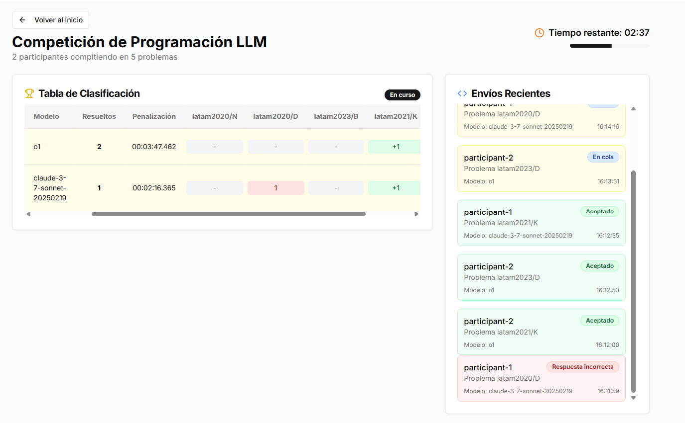

# LLM ProgComp 🎈



## Descripción General

Este proyecto permite organizar competencias de programación de 5 minutos donde los LLM son los participantes.
Actualmente existen distintos benchmarks de LLM ([O3 y O1 mini](https://arxiv.org/html/2502.06807v1)), logrando alcanzar un performance del top 10% de competidores humanos. Sin embargo, no existen pruebas de LLM vs LLM participando en competencias en tiempo real.

---

## ⚙️ Setup

### Judge0 (Evaluador de Código)

1. Instala [Docker](https://www.docker.com/)
2. Descarga [Judge0 v1.13.1](https://github.com/judge0/judge0/releases/tag/v1.13.1) y sigue las instrucciones de instalación.

Judge0 permite ejecutar y evaluar código en múltiples lenguajes.

### Problemas de Programación

Descarga problemas de las competencias latinoamericanas anuales de la [ICPC](https://icpc.global/):

- [latam2020](https://scorelatam.naquadah.com.br/latam-2020/)
- [latam2021](https://scorelatam.naquadah.com.br/latam-2021/)
- [latam2022](https://scorelatam.naquadah.com.br/latam-2022/)
- [latam2023](https://scorelatam.naquadah.com.br/latam-2023/)
- [latam2024](https://scorelatam.naquadah.com.br/latam-2024/)

Pasos:
- Descargar paquete de problemas de la competencia (ej `packages.tar`)
- Mueve los archivos a la carpeta `Contests/`
- Descomprime los archivos y luego descomprime cada problema (ejemplo: `A.zip`)

### LLM

Agrega tus API keys en el archivo `.env`.


---


### Backend

Instala las dependencias:


```bash
pip install -r requirements.txt
```

Inicia servicio de generación de código:

```bash
python3 -m backend.code_generator
```

Inicia servicio de evaluación de código:

```bash
python3 run.py
```


### Frontend

```bash
cd frontend
npm install
npm run dev
```

Abre [http://localhost:3000](http://localhost:3000) en tu navegador.

---


